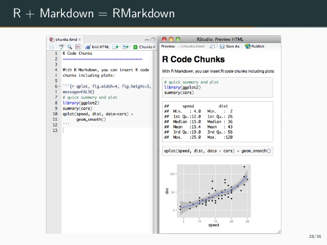
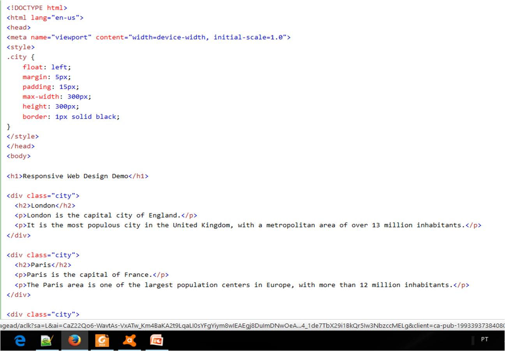
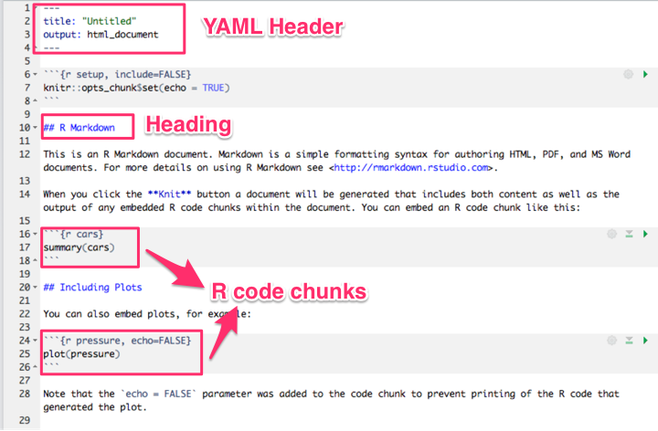

```{r setup, include=FALSE}
knitr::opts_chunk$set(echo = FALSE)
```

## R Markdown


## R Markdown



<!--

Markdown é uma linguagem de marcação simples para escrever textos<br>
O texto pode ser lido sem nenhum processamento, ou seja, da maneira como está escrito<br>
Outras linguagens de marcação como HTML e LATEX<br>
requerem um grande número de tags para formatar o texto, muitas vezes dificultando a leitura do código-fonte<br>
A proposta do Markdown é que o escritor se concentre no texto e não na formatação<br>
Pode ser convertido para vários outros formatos além de HTML<br>
fonte: Fernando Mayer (UFPR)
-->


## Pesquisa reprodutível

- Bancos de Dados
- Códigos
- Modelos
- Documentação
- Relátório

## HTML




## LATEX


## ROTEIRO

- Introdução (exemplos de Rmarkdown)
- Desenvolver Texto.
- Aprender ênfase e estilo (tamanho, negrito e itálico).
- Colocar hiperlink.
- Fazer tópicos/bullets.
- Colocar citação.
- Colocar imagem.
- Quebrar de linhas (HTML).
- Usar o YAML (word e pdf).
- Usar Bootstrap.

## ROTEIRO

- Programar em R dentro do Markdown.
- Gerar Gráficos.
- Gerar Tabelas.
- Gerar Matriz de Correlação.
- Gerar Mapa do Rio de Janeiro.
- Gerar Nuvem de palavras.
- Colocar equações do LaTeX no RMarkdown.
- Gerar Apresentações no Markdown.


## R Markdown




